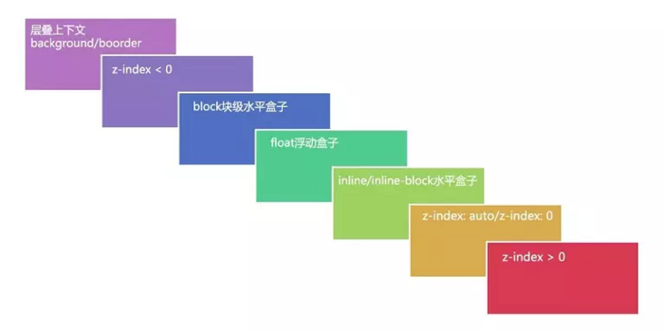

# CSS 知识总结

## CSS 盒模型

W3C 标准盒模型：属性width、height指的是content区域的宽度和高度

IE 盒模型：属性width、heigtht指的是content+padding+border的宽度和宽度

可通过`box-sizing`进行设置 DOM 元素的**盒子模型**，根据计算高度的区域可分为：

* `content-box`（W3C 标准盒模型）
* `border-box`（IE 盒模型）
* `padding-box`（FireFox 曾经支持）
* `margin-box`（浏览器未支持）

## 块级元素和行内元素

* 块级元素 block：遵循文档流默认宽度占满父级元素宽度，可以设置`margin`、`padding`、`width`和`height`
* 行内元素 inline：不能设置宽度和高度，宽高由自身内容宽高决定，并且在垂直方向的`padding`和`margin`会失效
* 行内块级元素 inline-block：可以设置宽度和高度，默认宽高由自身内容宽高决定，并且`padding`和`margin`水平垂直方向都有效

## CSS 选择器优先级

浏览器通过 CSS 权重的大小决定css样式的优先级，权重越高样式生效优先级越高。

* !important: 无限高
* 行内样式：权重值为 1000
* id 选择器：权重值为 100
* 类、伪类、属性选择器：权重值为 10
* 元素选择器、伪元素选择器：权重值为 1

## BFC

**块级格式化上下文**（BFC）是页面一个独立的渲染区域，让处于 BFC 内部的元素与外部元素相互隔离，使内外元素的定位布局不会相互影响。

* BFC 的特性：
  * BFC 内的元素不会影响外部其他元素的布局
  * BFC 内的浮动元素也会参与高度计算
  * 同一个 BFC 内的相邻元素垂直方向的 margin 会发生重叠
  * BFC 的元素按照水平方向依次排列
  * BFC 元素不会与 float 元素重叠

* BFC 的触发方式：
  * 根元素
  * `position`为 `fixed`, `absolute`
  * `float`不为`none`
  * `overflow`不为`visible`
  * `display`为`iniline-block`, `table-cell`, `table-caption`, `flex`, `inline-flex`

* 应用
  * 防止垂直`margin`重叠
  * 避免浮动元素覆盖
  * 清除内部浮动
  * 自适应两栏布局

> 除了 BFC 外，常见的格式化上下文类型有 IFC **行内格式化上下文**、FFC **自适应格式化上下文**以及 GFC **栅格格式化上下文**等。

## 清除浮动

* 追加尾元素清除浮动

  ```css
  .clear {
    clear: both
  }
  ```

* 伪类清除浮动

  ```css
  clearfix:after {
    content: '';
    display: inline-block;
    clear: both;
  }
  ```

* 触发父级 BFC

  ```css
  .outer {
    overflow: hidden;
  }
  ```

## 定位方式

* 相对定位`relative`：相对定位是相对于默认自身位置进行定位，设置的位置相对于自己进行位移，不脱离文档流
* 绝对定位`absolute`：绝对定位是相对于首个父级定位元素进行定位，脱离文档流
* 固定定位`fixed`：固定定位是相对于当前视图窗口进行定位，脱离文档流
* 粘性定位`sticky`：元素定位表现为在超过特定阀值前为相对定位，之后为固定定位
* 默认定位`static`：没有定位，按照普通文档流处于默认位置

## 居中布局

* 水平居中
  * 行内元素: 父元素设置`text-align: center`
  * 块级元素：
    * `margin`：父元素设置`margin: 0 auto`
    * `absolute` + `translate`: 子元素设置`position: absolute; left: 50%; transform: translateX(-50%)`
    * `flex`：父元素设置`diaplay: flex; justify-content: center`
    * `grid`：父元素设置`display: grid`，子元素设置`justify-self: center`
* 垂直居中
  * 行内元素：父元素设置`line-height: <height>`
  * 块级元素：
    * `absolute` + `translate`：子元素设置`position: absolute; top: 50%; transform: translateY(-50%)`
    * `flex`：父元素设置`display: flex; align-items: center`
    * `table`：父元素设置`display: table`，子节点设置`vertical-align: middle`
    * `grid`：父元素设置`display: grid`，子元素设置`align-self: center`

## 层叠上下文

**层叠上下文**是 HTML 中一个三维概念，HTML 元素基于其元素层叠属性按照优先级顺序在 z 轴排开。

* 触发条件：

  * 文档根元素
  * `z-index`值不为0的`position`定位元素
  * 包含其他 CSS3 属性
    * flex/grid 容器子元素，且`z-index`值不为`auto`
    * `opacity`值小于1元素
    * `transform`值不为`none`元素
    * `filter`值不为`none`元素
    * 其他

* 层叠等级：

  在同一个层叠上下文中，描述该层叠上下文中的层叠元素在Z轴的上下顺序，层叠顺序：`z-index`为正 > `z-index`为0 > 行内元素 > 浮动元素 > 块级元素 > `z-index`为负 > `background/border`。

  

## Flex 布局

* flex 容器属性

  * `flex-direction`：排列主轴方向

    ```css
    flex-diretion: row | row-reverse | column | column-reverse
    ```

  * `flex-wrap`：排列换行规则

    ```css
    flex-wrap: nowrap | wrap | wrap-reverse
    ```

  * `flex-flow`：`flex-direction`和`flex-wrap`的简写

    ```css
    flex-flow: <flex-direction> || <flex-wrap>
    ```

  * `justify-content`：主轴方向的对齐方式

    ```css
    justify-content: flex-start | flex-end | center | space-between | space-around | space-evenly
    ```

  * `align-items`：交叉轴方向的对其方式

    ```css
    align-items: stretch | flex-start | flex-end | center | baseline
    ```

  * `align-content`：交叉轴方向行元素的对其方式

    ```css
    align-content: stretch | flex-start | flex-end | center | space-between | space-around | space-evenly
    ```

* flex 子项属性

  * `order`：元素排列顺序

    ```css
    order: <integer> /* 整数值，默认值是 0 */
    ```

  * `flex-grow`：元素主轴方向扩展比列

    ```css
    flex-grow: <number> /* 数值，可以是小数，默认值是 0 */
    ```

  * `flex-shrink`：元素主轴方向收缩比例

    ```css
    flex-shrink: <number> /* 数值，默认值是 1 */
    ```

  * `flex-basis`：元素在主轴方向的初始大小

    ```css
    flex-basis: <length> | auto /* 默认值是 auto */
    ```

  * `flex`：`flex-grow`、`flex-shrink`和`flex-basis`的简写

    ```css
    flex: none | auto | [ <flex-grow> <flex-shrink>? || <flex-basis> ]
    ```

  * `align-self`：元素在交叉轴方向的对齐方式

    ```css
    align-self: auto | flex-start | flex-end | center | baseline | stretch
    ```

* flex 伸缩元素宽度计算方式

  * 伸展后宽度计算

    ```css
    元素初始宽度：itemBasisWidth = flexBasis || itemWidth
    伸展宽度：growWidth = width - sumBasisWidth
    伸展比例：itemGrowScale = itemGrow / sumGrow
    元素新宽度：newItemWidth = itemWidth + itemGrowScale * growWidth
    ```

  * 收缩后宽度计算

    ```css
    元素初始宽度：itemBasisWidth = flexBasis || itemWidth
    收缩宽度：shrinkWidth = sumBasisWidth - width
    元素收缩权重：itemShrinkWeight = itemBasisWidth * itemShrink
    元素新宽度：newItemWidth = itemWidth - (itemShrinkWeigth / sumShrinkWeight) * shrinkWidth
    ```

## 画三角形

```css
.tangle {
  width: 0;
  height: 0;
  border-left: 50px solid transparent;
  border-right: 50px solid transparent;
  border-top: 50px solid transparent;
  border-bottom: 50px solid blue;
}
```

## 隐藏元素

* `opacity: 0`：不会改变页面布局，并且可以触发该元素的绑定事件
* `visibility: hidden`：不会改变页面布局，但是不会触发该元素的绑定事件
* `display: none`：会改变页面布局，并且不会触发该元素的绑定事件

## CSS3 新特性

* 边框属性：`border-radius`, `box-shadow`等
* 背景属性：`background-size`, `background-origin`等
* 过度转换属性：`transform`, `transition`等

* 动画属性：`animation`等

## CSS 预处理器

**CSS 预处理器**（sass/less/postcss）是通过 webpack 等打包工具将编写的 CSS 扩展语法编译成浏览器可读的 CSS，通过预编译赋予 CSS 更多强大的功能，常用的功能有：

* 嵌套
* 变量
* 循环语句
* 条件语句
* 自动前缀
* 单位转换
* `minxin`混入

## transition 过度

* 属性：

  * `transition-property`：应用过度属性

    ```css
    transition-property: none | all | <custom-ident>
    ```

  * `transition-duration`：动画完成时长

    ```css
    transition-duration: <time>
    ```

  * `transition-timing-funciton`：动画加速度曲线

    ```css
    transition-timing-function: <timing-function>
    ```

  * `transition-delay`：开始时间延迟

    ```css
    transition: <time>
    ```

* 事件钩子：

  * `transitionend`：在 CSS Transition 结束后触发

## animation 动画

* 属性：

  * `animation-name`：动画 keyframe 名称

    ```css
    animation-name: none | <key-frames-name>
    ```

  * `animation-duration`：动画完成时长

    ```css
    animation-duration: <time>
    ```

  * `animation-timing-funciton`：动画加速度曲线

    ```css
    animation-timing-funciton: <timing-function>
    ```

  * `animation-delay`：开始时间延迟

    ```css
    animation-delay: <time>
    ```

  * `animation-iteration-count`：循环播放次数

    ```css
    animation-iteration-count: infinite | < number>
    ```

  * `animation-direction`：播放方向

    ```css
    animation-direction: normal | reverse | alternate | alternate-reverse
    ```

  * `animation-fill-mode`：静止模式

    ```css
    animation-fill-mode: none | forwards | backwards | both
    ```

  * `animation-paly-state`：播放状态

    ```css
    animation-paly-state: running | paused
    ```

* 事件钩子：

  * `animationend`：在一个 CSS Animation 完成时触发（不包括完成前终止的情况）

## tansition 与 animation 的区别

transition 和 animation ，它们的主要区别是 transition 需要触发一个修改过度属性的事件才能产生过度效果，而 animation 不需要触发任何事件就可以产生动画效果，并且 transtion 只有开始和结束两个关键帧，而 animation 可以由多个关键帧组成。

## px, em, rem 区别

* **px** 是绝对单位，像素 px 是**相对显示器屏幕分辨率**而言的，是一个虚拟长度单位，是计算机系统的数字化图像长度单位，如果 px 要换算成物理长度，需要指定精度 DPI
* **em** 是相对长度单位，**相对于当前元素内文本的字体尺寸**。如果
当前对行内文本的字体尺寸未进行设置，则相对于浏览器默认的字体尺寸。它会继承父级元素的字体大小，因此并不是一个固定的值
* **rem** 是 CSS3 新增的一个相对长度单位，与 em 不同的是，其**相对于 HTML 元素的字体尺寸**

## nth-child 和 nth-of-type 的区别

* `nth-child`选择的父元素的子元素，子元素并没有指定确切的类型
* `nth-of-type`选择的是父元素内相同类型的子元素

## link 与 @import 的区别

1. link是XHTML标签，除了加载CSS外，还可以定义RSS等其他事务；@import属于CSS范畴，只能加载CSS。
2. link引用CSS时，在页面载入时同时加载；@import需要等页面加载完成后加载。
3. link无兼容问题；@import是在CSS2.1提出的，低版本的浏览器不支持。
4. link 支持使用 js 动态引入，而@import不支持。

## display: table 与 table 的区别

`display: table`和本身 table 是相对应的，区别在于`display: table`能够让一个 html 元素像 table 元素一样，使用基于表格的 css 布局，使我们能够轻松定义一个单元格的边界、背景等样式， 而不会产生因为使用 table 标签导致的语译化问题。

之所以淘汰了 table 表格元素，是因为用 div+css 编写出来的文件比用 table 要小，而且 table 必须在页面完全加载后才显示，div 则是逐行显示。

## 两栏布局

* 浮动布局/绝对定位

  ```css
  .aside {
    // position: absolute;
  	float: left;
  	width: 300px;
  	background-color: blue;
  }
  .main {
    background-color: red;
    margin-left: 300px;
  }
  ```

* 浮动布局 + 负外边距

  ```css
  .aside {
  	float: left;
  	width: 300px;
  	background-color: blue;
  	margin-right: -100%;
  }
  .main {
  	width: 100%;
  	float: left;
  }
  .main > .content {
  	margin-left: 300px;
  	background-color: red;
  }
  ```

* flex 布局

  ```css
  .container {
  	display: flex;
  }
  .aside {
  	flex: 0 0 300px;
  	background-color: blue;
  }
  .main {
  	flex: 1;
  	backgorund-color: red;
  }
  ```

## 三栏布局

* 绝对定位

  ```css
  .left {
  	position: absolute;
  	left: 0;
  	right: 0;
  	width: 200px;
  	background-color: yellow;
  }
  .main {
  	margin-left: 200px;
  	margin-right: 300px;
  	background-color: red;
  }
  .right {
  	position: absolute;
  	top: 0;
  	right: 0;
  	width: 300px;
  	background-color: blue;
  }
  ```

* flex 布局

  ```css
  .container {
    display: flex;
  }
  .left {
    flex:  0 0 200px;
    background-color: yellow;
  }
  .main {
    flex: 1;
    background-color: red;
  }
  .right {
    flex: 0 0 300px;
    background-color: blue;
  }
  ```

* 双飞翼布局

  ```css
  // 中间栏在最前面
  .main {
  	width: 100%;
  	float: left;
  }
  .main > .content {
  	margin-left: 200px;
   	margin-right: 300px;
  	background-color: red;
  }
  .left {
    float: left;
    width: 200px;
    margin-left: -100%;
    background-color: yellow;
  }
  .right {
    float: left;
  	width: 300px;
    margin-left: -300px;
  	background-color: blue;
  }
  ```

* 圣杯布局

  ```css
  // 中间栏在最前面
  .container {
    padding-left: 200px;
    padding-right: 300px;
  }
  .main {
    float: left;
    width: 100%;
    background-color: red;
  }
  .left {
    position: relative;
    left: -200px;
    float: left;
    width: 200px;
    margin-left: -100%;
    background-color: yellow;
  }
  .right {
    position: relative;
    right: -300px;
    float: left;
    width: 300px;
    margin-left: -300px;
    background-color: blue;
  }
  ```

  