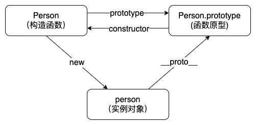

# Javascript 知识总结

## 数据类型

- **原始类型**（primitives）：`undefined`, `null`, `string`, `number`, `boolean`, `symbol`

- **引用类型**（objects）：`Object`, `Array`, `Function`, `Date`, `RegExp`, ...

在 ES10 中新增了第七种原始类型 `bigInt`，现 chrome 浏览器已支持

### Symbol 类型

`Symbol`类型是 ES6 中新增的一种基本数据类型，通过`Symbol()`返回的值都是唯一的。如果想要创建两个相等的`Symbol`变量，可以使用`Symbol.for(val)`

**`Symbol`的应用场景**

1. 私有属性

```js
const privateField = Symbol();
class myClass {
  constructor() {
    this[privateField] = 'ConardLi';
  }
  getField() {
    return this[privateField];
  }
  setField(val) {
    this[privateField] = val;
  }
}
```

2. 防止属性污染

```js
Function.prototype.myCall = function (context) {
  if (typeof this !== 'function') {
    return undefined; // 用于防止 Function.prototype.myCall() 直接调用
  }
  context = context || window;
  const fn = Symbol();
  context[fn] = this;
  const args = [...arguments].slice(1);
  const result = context[fn](...args);
  delete context[fn];
  return result;
};
```

3. 防止 XSS

```js
var REACT_ELEMENT_TYPE = (typeof Symbol === 'function' && Symbol.for && Symbol.for('react.element')) || 0xeac7;
```

### Number 类型

**IEEE 754**

`ECMAScript`中的`Number`类型遵循`IEEE 754`标准。使用 64 位固定长度来表示。


`JavaScript`使用的是 64 位双精度浮点数编码，所以它的`符号位`占`1`位，指数位占`11`位，尾数位占`52`位

**精度丢失**

> 为何 0.1 + 0.2 !== 0.3 ？

0.1 二进制表示为：`0.0001100110011001100...`

使用科学计数法表示：`1.100110011001100...` X 2-4

取 52 位尾数得到：

`1.100110011001100110011001100110011001100110011001101`

得到精度丢失的二进制值：

`0.0001100110011001100110011001100110011001100110011001101`

计算机使用精度丢失的二进制值进行运算，最终导致计算误差出现

## 类型转换

`Javascript`属于弱类型的语言，所以存在两种类型转换：**强制转换**和**隐式转换**

### 强制转换

强制转换即通过调用原始类型的构造函数手动进行的数据类型转换，如`Number`, `String`等

### 隐式转换

**对象转原始类型**

从引用类型到原始类型的转换，会遵循`toPrimitive`原则，其转换逻辑如下：
1. 如果存在`Symbol.toPrimitive`方法，优先调用再返回
2. 调用`valueOf`方法，如果转换为原始类型，则返回
3. 调用`toString`方法，如果抓换为原始类型，则返回
4. 如果都没有返回原始类型，则抛出`TypeError`异常

```js
const obj = {
  valueOf: () => {
    console.log('valueOf');
    return 123;
  },
  toString: () => {
    console.log('toString');
    return 'ConardLi';
  },
};
console.log(obj - 1); // valueOf   122
console.log(`${obj}ConardLi`); // toString  ConardLiConardLi

const obj2 = {
  [Symbol.toPrimitive]: () => {
    console.log('toPrimitive');
    return 123;
  },
};
console.log(obj2 - 1); // toPrimitive   122

const obj3 = {
  valueOf: () => {
    console.log('valueOf');
    return {};
  },
  toString: () => {
    console.log('toString');
    return {};
  },
};
console.log(obj3 - 1);
// valueOf
// toString
// TypeError
```

**if 语句和逻辑语句**

在`if`语句和逻辑语句中，会先将变量转换为`Boolean`值，然后再做判断，其中`nul`, `undefined`, `''`, `NaN`, `0`, `false`会转换成`false`，其他都转换成`true`

**四则运算符**

各种非`Number`类型运用数学运算符(`- * /`)时，会先将非`Number`类型转换为`Number`类型

`+`运算符是例外：

1.当一侧为`String`类型，被识别为字符串拼接，并会优先将另一侧转换为字符串类型

2.当一侧为`Number`类型，另一侧为原始类型，则将原始类型转换为`Number`类型

3.当一侧为`Number`类型，另一侧为引用类型，将引用类型和`Number`类型转换成字符串后拼接

```js
123 + '123'; // 123123   （规则1）
123 + null; // 123    （规则2）
123 + true; // 124    （规则2）
123 + {}; // 123[object Object]    （规则3）
```

**== 运算符**


## 类型判断

**typeof**

`typeof`运算符用于判断一个变量的基本数据类型，除了函数外所有的引用类型都会被判定为`object`，另外由于语言设计问题`null`值判断返回的也是`object`

**instanceof**

**`instanceof`** 运算符用于检测构造函数的 `prototype` 属性是否出现在某个实例对象的原型链上

因为可以修改构造函数的`prototye`属性，所以使用`instanceof`来检测数据类型并不会很准确，另外`instanceof`也不能检测基本数据类型

**Object.prototype.toString.call()**

默认情况下，调用`Object`对象的原型方法`toString`返回的是一个字符串`"[object type]"`，其中`type`表示的是当前变量的数据类型，通过`call`方法绑定到目标变量执行，可以得到我们想要的准确的数据类型

## 原型



- **构造函数**：可以通过`new`来新建一个对象的函数，构造函数通过`prototype`属性指向其原型对象
- **原型**`prototype`：每个对象都拥有一个原型对象，对象以其原型为模版，从原型继承方法和属性，其中这些属性和方法定义在`Object`类型的构造函数上的`prototype`属性上。原型通过`constructor`属性指向其构造函数
- **实例**：通过`new`执行构造函数新建出来的对象，实例通过`__proto__`属性指向其构造函数原型，，通过`constructor`属性指向其构造函数

## 原型链


**原型链**是由一个个的原型对象组成，每个实例对象都有一个`__proto__	`属性，指向它的构造函数的原型对象，原型对象也有一个自己的原型对象，层层向上直到一个对象的原型对象为`null`，通过`__proto__`属性连接构成原型链

- **对象属性查找机制**：当查找一个对象的属性时，如果该对象自身不存在该属性，则沿着原型链往上一级查找，找到则返回，否则继续沿着原型链往上一级查找，直到顶层原型对象`Object.prototype`，如果还是没有找到，则返回`undefined`

## 执行上下文

执行上下文（Execution context）是解析和执行 Javascript 代码所在环境的抽象概念，每当准备执行全局代码或函数时，就会创建一个执行上下文，执行上下文决定了变量或函数能够访问到哪些数据

- 执行上下文包含部分：
  - 变量环境组件：指一个**词法环境**对象，用于存储该执行上下文内`var`变量声明绑定和函数声明绑定等
  - 词法环境组件：指一个**词法环境**对象，用于存储该执行上下文内`let`和`const`变量声明绑定
  - `this`绑定：用于当前执行上下文内`Javascript`代码与外部环境进行关联，可以通过`this`访问关联环境的变量属性，在全局执行上下文中，`this`指向全局对象，在函数执行上下文中，`this`的指向取决于函数的调用方式

## 词法环境

## 作用域

## 作用域链

## 闭包

## new

## instanceof

## this 绑定

## 对象拷贝

## 模块化

## 防抖与节流

## 继承

## ES6/ES7
