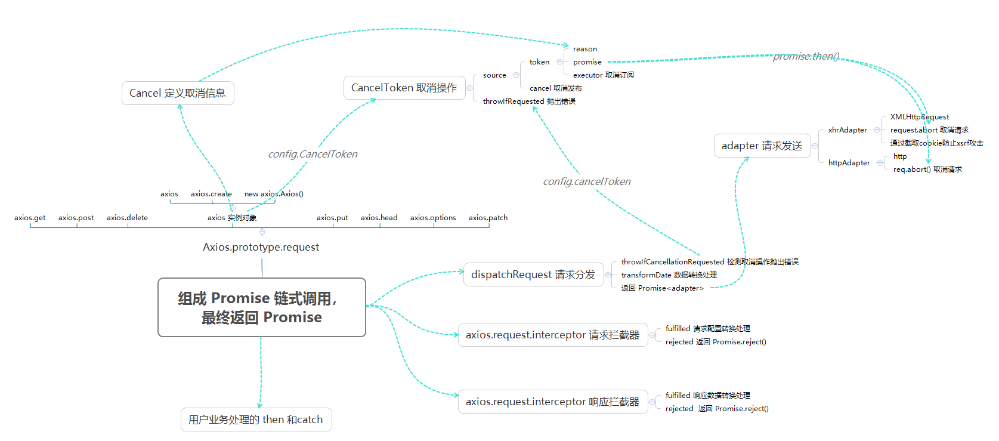

# 深入解读axios源码

## 1 前言

### 1.1 功能与特点

`axios`是一个基于`Promise`来管理的http请求库，本质上来说`axios`是对原生XHR的封装，是其基于`Promise`的实现版本，相对于Ajax的回调函数有更加好的链式异步操作管理。

`axios`的主要特性包括：

* 基于 Promise API
* 支持浏览器和node运行环境
* 提供数据拦截器和数据格式转换
* 提供请求取消功能
* 可自定义数据请求方式
* 自动转换JSON数据
* 支持客户端防范XSRF

### 1.2 项目目录结构

```
/lib
├── adapters                      # 请求发送适配器
│   ├── http.js                   # node环境http请求对象
│   └── xhr.js                    # 浏览器环境XML请求对象
├── axios.js                      # 入口，创建构造函数
├── cancel                        # 定义取消功能
├── core                          # 核心代码
│   ├── Axios.js                  # axios实例构造函数
│   ├── InterceptorManager.js     # 拦截器管理
│   ├── createError.js            # 抛出错误
│   ├── dispatchRequest.js        # 请求分发
│   ├── enhanceError.js           # 错误更新处理
│   ├── mergeConfig.js            # 合并配置参数
│   ├── settle.js                 # 根据返回状态码返回promise
│   └── transformData.js          # 数据传参格式转换
├── defaults.js                   # 默认配置
├── helpers                       # 辅助类方法
└── utils.js                      # 工具类方法
```

## 2 源码分析

### 2.1 入手准备

首先，查看axios项目的`package.json`文件，确定属性main的项目入口文件。

```json
// package.json
{
  "name": "axios",
  "version": "0.21.0",
  "description": "Promise based HTTP client for the browser and node.js",
  "main": "index.js", // 主入口文件
  ...
}
```

入口文件

```js
// index.js
module.exports = require('./lib/axios');
```

通过入口文件，可以知道`axios`函数的定义位置为，接下来我们将从`axios`函数定义入手，开始逐步分析`axios`源码。

### 2.2 axios 函数定义

```js
// lib/axios.js
'use strict';

var utils = require('./utils');
var bind = require('./helpers/bind');
var Axios = require('./core/Axios');
var mergeConfig = require('./core/mergeConfig');
var defaults = require('./defaults');

function createInstance(defaultConfig) {
	// 创建 Axios 构造函数实例
  var context = new Axios(defaultConfig);
  // 通过 bind 函数定义 instance 为调用 Axios.prototype.request 的函数
  // 也是调用axios是调用 Axios.prototype.request 函数的原因
  var instance = bind(Axios.prototype.request, context);

  // 复制 Axios 上的原型方法到 instance 上，包括request、get、post..等方法
  // 并修改 this 指针为指向 context
  utils.extend(instance, Axios.prototype, context);

  // 复制 context 到 intance 上
  // 复制默认配置和拦截器
  utils.extend(instance, context);

  return instance;
}

// 创建默认导出实例
var axios = createInstance(defaults);

// 导出Axios类，允许继承扩展
axios.Axios = Axios;

// 定义用于创建 axios 实例的工厂函数
axios.create = function create(instanceConfig) {
  return createInstance(mergeConfig(axios.defaults, instanceConfig));
};

// 绑定取消请求相关方法
axios.Cancel = require('./cancel/Cancel');
axios.CancelToken = require('./cancel/CancelToken');
axios.isCancel = require('./cancel/isCancel');

// 绑定用户并行处理的静态方法
axios.all = function all(promises) {
  return Promise.all(promises);
};
axios.spread = require('./helpers/spread');

// 绑定是否为 axios 内部错误方法
axios.isAxiosError = require('./helpers/isAxiosError');

module.exports = axios;

// 允许使用Ts 中的 default import 语法
module.exports.default = axios;
```

### 2.3  辅助工具类函数

#### 2.3.1 bind this绑定函数

```js
// bind 函数模拟实现
bind(fn, thisArg) {
  return function wrap() {
    var args = new Array(arguments.length);
    for (var i = 0; i < args.length; i++) {
      args[i] = arguments[i];
    }
    return fn.apply(thisArg, args);
  };
};
```

#### 2.3.2 utils.forEach 迭代器函数

```js
// 通过迭代器遍历 obj 属性并执行回调函数
function forEach(obj, fn) {
  // Don't bother if no value provided
  if (obj === null || typeof obj === 'undefined') {
    return;
  }

  // 强制转换 obj 为数组类型
  if (typeof obj !== 'object') {
    /*eslint no-param-reassign:0*/
    obj = [obj];
  }

  if (isArray(obj)) {
    // Iterate over array values
    for (var i = 0, l = obj.length; i < l; i++) {
      fn.call(null, obj[i], i, obj);
    }
  } else {
    // Iterate over object keys
    for (var key in obj) {
      if (Object.prototype.hasOwnProperty.call(obj, key)) {
        fn.call(null, obj[key], key, obj);
      }
    }
  }
}
```

#### 2.3.3 utils.extend 继承函数

```js
// 模拟类继承方法
function extend(a, b, thisArg) {
  forEach(b, function assignValue(val, key) {
    if (thisArg && typeof val === 'function') {
      // 修改 this 指针绑定
      a[key] = bind(val, thisArg);
    } else {
      a[key] = val;
    }
  });
  return a;
}
```

### 2.4 Axios 核心构造函数

```js
// lib/core/Axios.js
'use strict';

var utils = require('./../utils');
var buildURL = require('../helpers/buildURL');
var InterceptorManager = require('./InterceptorManager');
var dispatchRequest = require('./dispatchRequest');
var mergeConfig = require('./mergeConfig');

// Axios构造函数
function Axios(instanceConfig) {
  this.defaults = instanceConfig; // 绑定默认配置或个人配置
  this.interceptors = {
    request: new InterceptorManager(), // 请求拦截器管理
    response: new InterceptorManager() // 响应拦截器管理
  };
}
```

#### 2.4.1 Axios.prototype.request 请求核心方法

```js
Axios.prototype.request = function request(config) {
  if (typeof config === 'string') {
    config = arguments[1] || {};
    config.url = arguments[0];
  } else {
    config = config || {};
  }
	// 合并配置
  config = mergeConfig(this.defaults, config);

  // 设定请求方法
  if (config.method) {
    config.method = config.method.toLowerCase();
  } else if (this.defaults.method) {
    config.method = this.defaults.method.toLowerCase();
  } else {
    config.method = 'get';
  }

  // 创建一个串联拦截器的序列数组
  // 第一个为发送请求的请求分发函数，第二个是 undefined
  var chain = [dispatchRequest, undefined];
  // 创建一个Promise，默认返回实例配置
  // 用于chain数组元素执行返回的链式传递
  var promise = Promise.resolve(config);

  // 遍历实例的所有请求拦截器函数，放到 chain 数组的前面
  // 确保在请求发送之前进行拦截处理请求配置
  this.interceptors.request.forEach(function unshiftRequestInterceptors(interceptor) {
    chain.unshift(interceptor.fulfilled, interceptor.rejected);
  });

  // 遍历实例的所有响应拦截器函数，放到 chain 数组的后面
  // 确保在获取请求响应之前进行拦截处理响应返回结果
  this.interceptors.response.forEach(function pushResponseInterceptors(interceptor) {
    chain.push(interceptor.fulfilled, interceptor.rejected);
  });

  // 链式传递数组元素执行返回结果
  while (chain.length) {
    promise = promise.then(chain.shift(), chain.shift());
  }

  // 返回最终经过响应拦截器处理的结果
  return promise;
};
```

#### 2.4.2 axios[alias] 别名请求方法

```js
// 实现通过调用 axios.get 等别名的方式，间接调用 Axios.prototype.request 方法
utils.forEach(['delete', 'get', 'head', 'options'], function forEachMethodNoData(method) {
  Axios.prototype[method] = function(url, config) {
    return this.request(mergeConfig(config || {}, {
      method: method,
      url: url,
      data: (config || {}).data
    }));
  };
});

utils.forEach(['post', 'put', 'patch'], function forEachMethodWithData(method) {
  /*eslint func-names:0*/
  Axios.prototype[method] = function(url, data, config) {
    return this.request(mergeConfig(config || {}, {
      method: method,
      url: url,
      data: data
    }));
  };
});
```

### 2.5 InterceptorManager 拦截器管理

```js
// lib/core/InterceptorManager.js

var utils = require('./../utils');

function InterceptorManager() {
	// 用于存储拦截器
  this.handlers = [];
}

// Axios实例调用 incterceptors.request.use 或 interceptors.response.use 往栈中插入拦截器
// 返回拦截器在栈中索引
InterceptorManager.prototype.use = function use(fulfilled, rejected) {
  this.handlers.push({
    fulfilled: fulfilled,
    rejected: rejected
  });
  return this.handlers.length - 1;
};

// Axios实例调用 incterceptors.request.eject 或 interceptors.response.eject 删除栈中的对应的拦截器
InterceptorManager.prototype.eject = function eject(id) {
  if (this.handlers[id]) {
    this.handlers[id] = null;
  }
};

// 通过 utils.forEach 遍历所有拦截器，并执回调函数
InterceptorManager.prototype.forEach = function forEach(fn) {
  utils.forEach(this.handlers, function forEachHandler(h) {
    if (h !== null) {
      fn(h);
    }
  });
};

module.exports = InterceptorManager;
```

### 2.6 dispatchRequest 请求分发

```js
'use strict';

var utils = require('./../utils');
var transformData = require('./transformData');
var isCancel = require('../cancel/isCancel');
var defaults = require('../defaults');

// 如果存在取消操作，则通过调用 config.cancelToken.throwIfRequest 方法抛出错误
function throwIfCancellationRequested(config) {
  if (config.cancelToken) {
    config.cancelToken.throwIfRequested();
  }
}

// 请求分发函数定义
module.exports = function dispatchRequest(config) {
  // 在请求发送之前检测取消事件是否被触发
  throwIfCancellationRequested(config);

  // 确保 headers 对象存在
  config.headers = config.headers || {};

  // 转换请求数据
  config.data = transformData(
    config.data,
    config.headers,
    config.transformRequest
  );

  // 拍平 headers 对象，变为”一维“对象
  config.headers = utils.merge(
    config.headers.common || {},
    config.headers[config.method] || {},
    config.headers
  );

  // 函数 headers 上定义不同请求方法的 headers 配置
  utils.forEach(
    ['delete', 'get', 'head', 'post', 'put', 'patch', 'common'],
    function cleanHeaderConfig(method) {
      delete config.headers[method];
    }
  );

  // 发送请求适配器
  var adapter = config.adapter || defaults.adapter;

  return adapter(config).then(function onAdapterResolution(response) {
    // 在响应结果返回后检测取消事件是否被触发
    throwIfCancellationRequested(config);

    // 转换数据格式，包括转换JSON数据等
    response.data = transformData(
      response.data,
      response.headers,
      config.transformResponse
    );

    return response;
  }, function onAdapterRejection(reason) {
    // 判断前面是否触发取消事件
    if (!isCancel(reason)) {
      // 如果前面请求未进行取消事件触发时，检测取消事件是否被触发
      throwIfCancellationRequested(config);

      // 转换数据格式，包括转换JSON数据等
      if (reason && reason.response) {
        reason.response.data = transformData(
          reason.response.data,
          reason.response.headers,
          config.transformResponse
        );
      }
    }

    return Promise.reject(reason);
  });
};

```

### 2.7 CancelToken 取消请求

首先我们查看使用`cancel token`取消请求的例子

```js
const CancelToken = axios.CancelToken;
const source = CancelToken.source();

axios.get('/user/12345', {
  cancelToken: source.token
}).catch(function(thrown) {
  if (axios.isCancel(thrown)) {
    console.log('Request canceled', thrown.message);
  } else {
     // 处理错误
  }
});

// 执行 cancel 触发取消请求
source.cancel('Operation canceled by the user.');
```

通过查看取消请求例子，我们可以发现，`axios`取消请求处理并没有耦合在`axios`实例对象内来进行处理，而是通过定义一个`CancelToken`构造函数来集中处理取消请求，接下来我们来逐步分析`CancelToken`构造函数的实现，学习其是如何通过`CancelToken`触发取消请求，并向外抛出取消错误信息。

```js
'use strict';

var Cancel = require('./Cancel');

// 用于进行取消操作对象
// 通过发布订阅模式来实现传递取消信息
function CancelToken(executor) {
  if (typeof executor !== 'function') {
    throw new TypeError('executor must be a function.');
  }

  // 创建 promise 对象，用于后续的链式调用
  var resolvePromise;
  this.promise = new Promise(function promiseExecutor(resolve) {
    resolvePromise = resolve;
  });

  var token = this;
	// 执行订阅者，监听 cancel 发布者执行
  executor(function cancel(message) {
    if (token.reason) {
      // Cancellation has already been requested
      return;
    }

    token.reason = new Cancel(message);
    // 执行 this.promise 对象的 resolve 方法，用于异步触发xhr.js或http.js的 request.abort()方法执行，停止接口请求
    resolvePromise(token.reason);
  });
}

// 如果已触发取消事件，则抛出一个错误信息
CancelToken.prototype.throwIfRequested = function throwIfRequested() {
  if (this.reason) {
    throw this.reason;
  }
};

// 通过 CancelToken.source 方法构建 CancelToken 实例
CancelToken.source = function source() {
  var cancel;
  var token = new CancelToken(function executor(c) {
    // 获取 cancel 发布者
    cancel = c;
  });
  return {
    token: token,
    cancel: cancel
  };
};

module.exports = CancelToken;

```

因此，不难发现`CancelToken`构造函数就是一个发布订阅函数，通过发布订阅触发向外抛出错误，`Promise`链式结构`catch`到错误后，停止继续执行并执行错误回调。

## 3 执行流程梳理

根据以上源码的分析解读，以下是本人总结出来的，`axios`的整个执行流程如下：



## 4 个人总结

`axios`作为一个优秀的`http`请求库，其兼容了浏览器和`nodejs`环境下的`http`接口请求，能够满足日常的各种`http`接口请求的项目开发，同时，该请求库也提供了高度可定制化的配置和默认配置，方便开发者根据不同的需求进行自定义配置，这也是其能够成为最受欢迎的`http`请求库的原因。通过分析解读`axios`源码，我们可以从其中学习到许多需要优秀的编程思想和设计模式，其项目结构很好的诠释了单一职责原则：每个函数只负责处理一项界定的功能，这样的编程方式能够让后开发者仅仅是针对某一项功能进行修改而不会影响到项目的整体流程，极大的减少项目的额后期功能迭代和维护成本；该项目使用的设计模式包括：工厂模式、迭代器模式、适配器模式、发布订阅模式等，通过这些设计模式引入，通过引入这些设计模式，能够帮助开发者很好的组织项目代码。

以上便是我本人在学习解读`axios`源码过程中的理解和认识的个人笔记。